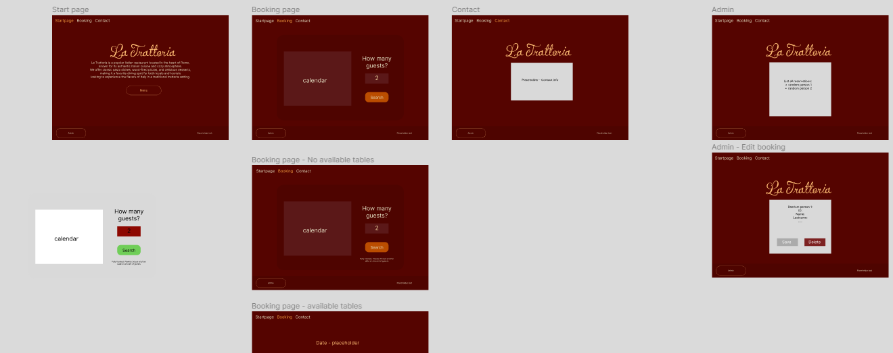
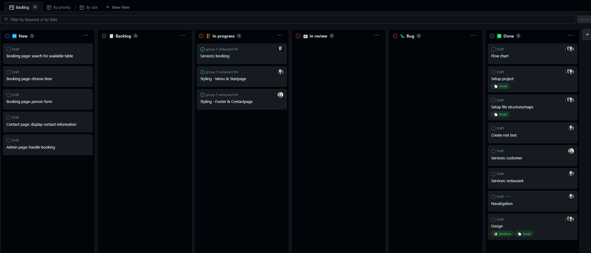

# Daily Standup

During our daily standup today, we reviewed our work from yesterday, merged essential branches into the main branch, designed a wireframe in Figma, selected a color palette for our design, and discussed issues on github.

## Emilia

Yesterday I've worked with creating a general get-function as well as a service file for the restaurant. Today I will start working on the menu and startpage design.

## Filip

Yesterday I implemented 3/5 end-points for the booking functionality and tested these in our .rest file, today I will keep implementing the rest of the end-points and begin working on our booking page component.

## Nani

Yesterday, I worked on all the customer endpoints. Today, I will be focusing on the footer and the contact page.

## Screenshots

Wireframe:

Backlog:

